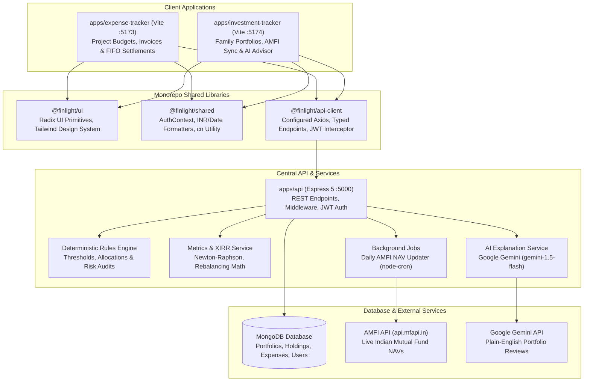

# ⚡ Finlight — Modern Monorepo for Expense & Wealth Management

[](https://turbo.build/)
[](https://reactjs.org/)
[](https://expressjs.com/)
[](https://www.mongodb.com/)
[](https://ai.google.dev/)
[](https://tailwindcss.com/)

**Finlight** is an enterprise-grade, full-stack financial ecosystem configured as a **Turborepo monorepo**. It bridges the gap between daily **operational expense management** (projects, budgets, vendor settlements, FIFO invoice reconciliation) and personal/family **wealth management** (multi-asset portfolios, live AMFI mutual fund sync, Newton-Raphson XIRR, goal tracking, and deterministic AI portfolio intelligence powered by Google Gemini).

---

## 📑 Table of Contents

- [Architectural Overview](#-architectural-overview)
- [Monorepo Directory Structure](#-monorepo-directory-structure)
- [Packages & Applications Breakdown](#-packages--applications-breakdown)
- [Application Deep Dive: Expense Tracker](#-application-deep-dive-expense-tracker)
  - [1. Dashboard & Financial Metrics](#1-dashboard--financial-metrics)
  - [2. Project & Budget Management](#2-project--budget-management)
  - [3. Expense Recording & File Attachments](#3-expense-recording--file-attachments)
  - [4. Supplier Management & FIFO Settlement Engine](#4-supplier-management--fifo-settlement-engine)
  - [5. Reporting & Document Export (PDF / Excel)](#5-reporting--document-export-pdf--excel)
- [Application Deep Dive: Wealth & Investment Tracker](#-application-deep-dive-wealth--investment-tracker)
  - [1. Multi-Member Family Portfolios & Risk Profiles](#1-multi-member-family-portfolios--risk-profiles)
  - [2. Multi-Asset Holdings Management](#2-multi-asset-holdings-management)
  - [3. Live AMFI Mutual Fund Sync & Automated Cron](#3-live-amfi-mutual-fund-sync--automated-cron)
  - [4. Transaction Ledger & Auto-Cost Recalculation](#4-transaction-ledger--auto-cost-recalculation)
  - [5. Goal-Based Investing & Milestones](#5-goal-based-investing--milestones)
  - [6. Performance Analytics & Newton-Raphson XIRR](#6-performance-analytics--newton-raphson-xirr)
  - [7. AI Portfolio Intelligence Engine](#7-ai-portfolio-intelligence-engine)
  - [8. What-If Scenario Simulator & Holding Explainer](#8-what-if-scenario-simulator--holding-explainer)
- [Shared Packages Design System](#-shared-packages-design-system)
- [Central Backend API & Services](#-central-backend-api--services)
  - [API Route Matrix](#api-route-matrix)
  - [Database Schemas & Data Models](#database-schemas--data-models)
- [Getting Started & Local Development](#-getting-started--local-development)
  - [Prerequisites](#prerequisites)
  - [Environment Configuration](#environment-configuration)
  - [Development Scripts](#development-scripts)
- [Tech Stack Reference](#-tech-stack-reference)

---

## 🏛 Architectural Overview

Finlight is architected around a strict separation of concerns with a shared component and utility foundation:



---

## 📁 Monorepo Directory Structure

```text
expence-tracker/
├── apps/
│   ├── api/                          # Express 5 REST API + MongoDB backend
│   │   ├── config/                   # MongoDB connection configuration
│   │   ├── controllers/              # Business controllers (Expenses, Portfolios, Reports, etc.)
│   │   ├── jobs/                     # node-cron tasks (AMFI NAV daily updater)
│   │   ├── middleware/               # JWT authentication, error handling, Multer file upload
│   │   ├── models/                   # Mongoose models (Expense, Portfolio, Holding, Goal, etc.)
│   │   ├── routes/                   # Express routes (auth, expenses, ai, reports, etc.)
│   │   ├── services/                 # Rules engine, portfolio metrics, AI service, ledger math
│   │   ├── uploads/                  # Uploaded invoice files and receipts
│   │   ├── utils/                    # XIRR Newton-Raphson calculator, AMFI fetcher
│   │   └── server.js                 # Server entry point, CORS, and route mounting
│   │
│   ├── expense-tracker/              # Standalone Expense Management Web App (Port 5173)
│   │   ├── src/
│   │   │   ├── components/           # Common components, layouts, dashboard widgets
│   │   │   ├── pages/                # Dashboard, ExpenseList, AddExpense, Projects, Reports, etc.
│   │   │   ├── App.jsx               # Route definitions and protected route wrapper
│   │   │   └── main.jsx              # React DOM entry
│   │   └── vite.config.js            # Vite build and dev server config
│   │
│   └── investment-tracker/           # Standalone Wealth Management & AI Web App (Port 5174)
│       ├── src/
│       │   ├── components/           # Portfolio modals, AI advisor panel, fund tables, charts
│       │   ├── context/              # PortfolioContext (Active profile, holdings, reloads)
│       │   ├── pages/Portfolio/      # PortfolioDashboard, HoldingsList, Transactions, Analytics
│       │   ├── App.jsx               # Route tree, redirects, and context providers
│       │   └── main.jsx              # React DOM entry
│       └── vite.config.js            # Vite build and dev server config
│
├── packages/
│   ├── shared/                       # @finlight/shared
│   │   └── src/                      # AuthContext, currency (₹ INR) formatters, utility helpers
│   │
│   ├── ui/                           # @finlight/ui
│   │   └── src/                      # Reusable UI component system (Radix UI + Tailwind)
│   │
│   └── api-client/                   # @finlight/api-client
│       └── src/                      # Centralized axios client with JWT handling and API methods
│
├── package.json                      # Monorepo root scripts & workspace configuration
├── pnpm-workspace.yaml               # pnpm workspace definition
├── turbo.json                        # Turborepo task pipeline configuration
└── README.md                         # Comprehensive documentation
```

---

## 📦 Packages & Applications Breakdown

| Package / App | Path | Type | Port | Description |
|---|---|---|:---:|---|
| **`@finlight/api`** | `apps/api` | Node / Express API | `5000` | Central backend API with MongoDB, JWT security, deterministic rules engine, and Gemini AI endpoints. |
| **`expense-tracker`** | `apps/expense-tracker` | React + Vite App | `5173` | Operational expenses, project costing, invoice uploads, supplier balance ledgers, and FIFO settlements. |
| **`investment-tracker`** | `apps/investment-tracker` | React + Vite App | `5174` | Personal and family wealth manager with multi-asset tracking, live AMFI mutual fund NAVs, and AI intelligence. |
| **`@finlight/ui`** | `packages/ui` | Shared UI Library | — | Reusable design system built on Radix UI primitives and Tailwind CSS (`MetricCard`, `Table`, `Dialog`, etc.). |
| **`@finlight/shared`** | `packages/shared` | Shared Core Logic | — | Universal `AuthContext`, Indian currency formatters (`₹` Lakhs/Crores), date utilities, and `cn`. |
| **`@finlight/api-client`** | `packages/api-client` | API SDK Client | — | Unified Axios HTTP client with automatic JWT header injection and domain-specific API call methods. |

---

## 💼 Application Deep Dive: Expense Tracker

The Expense Management client (`apps/expense-tracker`) is built for businesses, contractors, and individuals who need rigorous tracking of project-specific expenses, vendor balances, and financial reporting.

### 1. Dashboard & Financial Metrics
- **Real-Time KPI Cards**: Total spent, today's spending, weekly/monthly spending run rates, and active pending liabilities.
- **Dynamic Charts**:
  - **12-Month Expense Trend**: Area chart showing spending trajectories over time.
  - **Category Breakdown**: Donut chart visualizing expenditure distribution across categories.
  - **Project Allocation**: Spending comparison across active client projects.
- **Recent Activity Ledger**: Immediate view of the latest transactions with payment status badges (`paid`, `pending`).

### 2. Project & Budget Management
- **Project Tracking**: Group operational costs under discrete projects with attributes like client name, budget threshold, and status (`planning`, `active`, `completed`, `on-hold`).
- **Project Detail View**: Real-time progress bar of budget consumed vs. remaining allocated funds.
- **Budget Alerts**: Category and monthly budget controls with visual alerts when expenditures approach or exceed set limits.

### 3. Expense Recording & File Attachments
- **Granular Entry Schema**: Item name, quantity, standard commercial units (pieces, kg, bags, sqft, sqm, cft, liters, tons, trips, days, hours, etc.), unit rate, and total amount.
- **Payment Lifecycle**: Multi-mode payment tracking (`cash`, `upi`, `bank`, `cheque`, `credit`, `other`) with state management (`paid`, `pending`, partially paid with `paidAmount`).
- **Receipt & Invoice Upload**: Integrated Multer multipart file upload handling attachments (PDF, JPEG, PNG) stored and downloadable directly from the expense view.
- **Advanced Querying & Bulk Operations**:
  - Filtering by project, category, subcategory, supplier name, payment method, payment status, date ranges, and price ranges.
  - Bulk updating vendor names or attributes across multiple transactions in a single action.

### 4. Supplier Management & FIFO Settlement Engine
- **Vendor Directory**: Automated compilation of all unique vendors, cumulative procurement values, total payments made, and net outstanding liabilities.
- **Supplier Ledger**: Chronological transaction statement contrasting individual purchase bills against settlement payouts.
- **FIFO (First-In, First-Out) Payout Algorithm**:
  - When paying a vendor, entering a lump-sum amount automatically traverses all pending expenses for that supplier in chronological order (oldest first).
  - The engine applies the payout, updates `paidAmount`, transitions fully satisfied bills to `paid`, handles partial balance remainders, and records a permanent `SupplierSettlement` audit record.

### 5. Reporting & Document Export (PDF / Excel)
- **Analytical Breakdowns**: Daily, weekly, monthly, category-wise, and supplier-wise aggregated summaries.
- **One-Click PDF Export**: Uses `jsPDF` and `jspdf-autotable` to generate professional, formatted PDF balance sheets and expense summaries.
- **Excel (.xlsx) Export**: Uses `xlsx` (SheetJS) to generate multi-tab, ready-to-audit spreadsheets.

---

## 📈 Application Deep Dive: Wealth & Investment Tracker

The Wealth Management client (`apps/investment-tracker`) manages personal and multi-member family investments, asset allocation balancing, and portfolio intelligence.

### 1. Multi-Member Family Portfolios & Risk Profiles
- **Multi-Profile Switcher**: Seamlessly switch between family member portfolios (`Self`, `Spouse`, `Father`, `Mother`, `Child`, `Other`).
- **Custom Risk Profiles**: Assign risk mandates per portfolio (`Conservative`, `Moderate`, `Aggressive`).
- **Target Asset Allocations**: Define target weightings for **Equity %**, **Debt %**, and **Gold %** to enable automated rebalancing calculations.

### 2. Multi-Asset Holdings Management
Tracks a broad spectrum of asset categories:
- **Mutual Funds (MF)**: Auto-updating NAVs, AMC scheme names, and fund categories.
- **Exchange Traded Funds (ETFs) & Equities**: Market symbols, units, purchase price, current price.
- **Fixed Deposits (FD) & PPF**: Maturity date tracking, interest yields, and tenure monitors.
- **Gold & Sovereign Gold Bonds (SGB)**: Precious metal holdings and allocation weight.
- **Liquid & Savings**: Emergency reserves and cash equivalents.
- **Market Cap Classification**: Large Cap, Mid Cap, Small Cap, and Multi-Cap classifications.

### 3. Live AMFI Mutual Fund Sync & Automated Cron
- **AMFI Scheme Directory Integration**: Real-time scheme search powered by `api.mfapi.in` allowing users to search and select from thousands of Indian mutual funds by code or scheme name.
- **Live NAV Sync**: Fetches current Net Asset Value upon addition and refresh.
- **Automated Cron Job**: A scheduled background job runs **every weekday at 11:30 PM (IST)** (`jobs/priceUpdater.js`) to refresh cached NAVs in MongoDB (`PriceCache`) for all active portfolio holdings.

### 4. Transaction Ledger & Auto-Cost Recalculation
- **Investment Transactions**: Logs all transaction types (`BUY`, `SELL`, `SIP`, `SWITCH_IN`, `SWITCH_OUT`, `DIVIDEND`).
- **Dynamic Ledger Recalculation (`ledgerService.js`)**:
  - Incrementally recalculates active units and weighted average buy cost on every new transaction.
  - When units are sold or switched out, reduces the invested capital base proportionally, preventing fractional remainder drift.

### 5. Goal-Based Investing & Milestones
- **Goal Association**: Map investment portfolios directly to financial milestones (e.g., Retirement Corpus, Child Education, Home Downpayment, Emergency Fund).
- **Progress Tracking**: Calculates target amount, maturity horizon, current linked asset valuation, and percentage achieved.
- **Health Indicators**: Dynamic status badges (`On Track` > 80%, `In Progress`, `At Risk` < 50%).

### 6. Performance Analytics & Newton-Raphson XIRR
- **Newton-Raphson XIRR Calculator (`xirrCalculator.js`)**: Computes the true Extended Internal Rate of Return across irregular investment cash inflows and outflows.
- **Rebalancing Delta Engine**: Identifies deviations between current asset weights and designated risk profile targets, computing exact rupee amounts to buy or sell to restore target equilibrium.
- **Concentration Risk Analyzer**: Identifies single-asset concentration where any individual holding exceeds 15% (warning) or 25% (caution) of the entire portfolio value.

### 7. AI Portfolio Intelligence Engine
Finlight adopts a **3-tier safeguarded AI architecture**. Unlike naive AI wrappers that pass raw financial data to an LLM, Finlight guarantees zero hallucinated numbers:

```
[ MongoDB Data ] 
       │
       ▼
[ Layer 1: Pure Math (`portfolioMetricsService.js`) ]
  - Absolute returns, holding weights, target allocation deltas, goal progress
       │
       ▼
[ Layer 2: Deterministic Rules Engine (`rulesEngine.js`) ]
  - Evaluates deviations, concentration, diversification, maturities against strict thresholds
  - Produces structured findings with severity ('warning' / 'caution') and numerical evidence
       │
       ▼
[ Layer 3: AI Explanation Layer (`aiService.js` via Gemini 1.5 Flash) ]
  - Receives curated context and structured findings ONLY (never raw DB docs)
  - Strict system prompt: cannot invent findings, cannot calculate numbers, cannot give buy/sell calls
  - Outputs plain-English, jargon-free explanations & considerations for Indian retail investors
```

### 8. What-If Scenario Simulator & Holding Explainer
- **Holding Explainer**: Instant contextual breakdown of individual investments explaining what the asset is, its portfolio role, key risks, and what metrics to monitor.
- **What-If Scenario Simulator**: Simulates portfolio outcomes under market events (e.g., market corrections, rate cuts, lump-sum additions) and provides natural-language analysis of the likely impact on asset allocation and long-term goals.

---

## 🎨 Shared Packages Design System

### 1. `@finlight/shared`
- **`AuthContext` (`useAuth`)**: Centralized React context managing user authentication state, JWT storage in `localStorage`, login, registration, and logout across both client applications.
- **Financial Formatters**:
  - `formatCurrency(val)`: Formats numbers into Indian Rupee notation (`₹1,50,000.00`) with support for Lakhs and Crores.
  - `formatPercent(val)`: Signed percentages with precision control (`+12.45%`).
  - `formatDate(date)`: Localized human-readable date strings.
- **Utilities**: Standard `cn()` helper combining `clsx` and `tailwind-merge`.

### 2. `@finlight/ui`
Modular design system built on Radix UI primitives and Tailwind CSS with light and dark mode tokens:
- **Primitives**: `Button`, `Badge`, `Card`, `Dialog`, `Input`, `Label`, `Popover`, `Progress`, `ScrollArea`, `Select`, `Separator`, `Sheet`, `Sidebar`, `Skeleton`, `Table`, `Textarea`, `Tooltip`.
- **Domain Components**: `MetricCard` (KPI presentation with trend arrows, percentage delta, and icon badges).

### 3. `@finlight/api-client`
- Pre-configured Axios instance with base URL resolution and automatic JWT `Bearer` token header injection via request interceptors.
- Typed and organized API namespaces:
  - `authApi`: User login, registration, profile retrieval.
  - `expenseApi`: Expense CRUD, summaries, bulk updates, supplier payouts.
  - `portfolioApi`: Portfolio profiles, holdings CRUD, investment goals, PDF/Excel export.
  - `transactionApi`: Investment transactions and history.
  - `mfApi`: AMFI scheme search and live NAV query.
  - `aiApi`: Portfolio reviews, holding explanations, and what-if simulation scenarios.

---

## 🔌 Central Backend API & Services

The backend is built with Express 5, Mongoose 9, Multer, and node-cron.

### API Route Matrix

| Domain | Method | Endpoint | Description |
|---|:---:|---|---|
| **Auth** | `POST` | `/api/auth/register` | Register new user account |
| | `POST` | `/api/auth/login` | Authenticate user & issue JWT |
| | `GET` | `/api/auth/me` | Retrieve authenticated user profile |
| **Expenses** | `GET` | `/api/expenses` | Paginated expenses with search & filters |
| | `POST` | `/api/expenses` | Create expense with optional receipt upload |
| | `GET` | `/api/expenses/:id` | Get single expense details |
| | `PUT` | `/api/expenses/:id` | Update expense record & receipt |
| | `DELETE`| `/api/expenses/:id` | Delete expense record |
| | `GET` | `/api/expenses/summary/dashboard` | Aggregated dashboard KPI metrics |
| | `PUT` | `/api/expenses/bulk-update` | Bulk assign supplier or attributes |
| | `POST` | `/api/expenses/payout` | Apply FIFO payout against supplier bills |
| **Suppliers** | `GET` | `/api/suppliers/summary` | All suppliers with total spend & pending balance |
| | `GET` | `/api/suppliers/ledger/:name` | Chronological ledger statement for supplier |
| | `GET` | `/api/suppliers/:name/settlements`| Settlement payout history |
| | `POST` | `/api/suppliers/settle` | Record vendor settlement transaction |
| | `DELETE`| `/api/suppliers/settlements/:id` | Delete a settlement record |
| **Projects** | `GET` | `/api/projects` | List all user projects |
| | `POST` | `/api/projects` | Create a new project with budget limit |
| | `GET` | `/api/projects/:id` | Project details with spend progress |
| | `PUT` | `/api/projects/:id` | Update project details |
| | `DELETE`| `/api/projects/:id` | Delete project |
| **Categories**| `GET` | `/api/categories` | List user custom expense categories |
| | `POST` | `/api/categories` | Create category with icon & color code |
| **Reports** | `GET` | `/api/reports/daily` | Daily expenditure breakdown |
| | `GET` | `/api/reports/weekly` | Weekly expenditure breakdown |
| | `GET` | `/api/reports/monthly` | Monthly expenditure breakdown |
| | `GET` | `/api/reports/category` | Category distribution & averages |
| | `GET` | `/api/reports/supplier` | Supplier payment summaries |
| | `GET` | `/api/reports/export/pdf` | Export expense report to PDF |
| | `GET` | `/api/reports/export/excel` | Export expense report to Excel |
| **Portfolios**| `GET` | `/api/portfolios` | List all family member portfolios |
| | `POST` | `/api/portfolios` | Create portfolio with risk profile & target allocations |
| | `GET` | `/api/portfolios/:id` | Get portfolio details & holdings summary |
| | `PUT` | `/api/portfolios/:id` | Update portfolio parameters |
| | `DELETE`| `/api/portfolios/:id` | Delete portfolio |
| | `GET` | `/api/portfolios/:id/export/pdf` | Export portfolio report to PDF |
| | `GET` | `/api/portfolios/:id/export/excel`| Export portfolio report to Excel |
| **Holdings** | `GET` | `/api/holdings/:portfolioId` | List holdings for portfolio |
| | `POST` | `/api/holdings` | Add investment holding (MF, Stock, FD, etc.) |
| | `PUT` | `/api/holdings/:id` | Update holding details |
| | `DELETE`| `/api/holdings/:id` | Delete holding |
| **Transactions**| `GET` | `/api/transactions/:portfolioId`| List investment transactions |
| | `POST` | `/api/transactions` | Record BUY, SELL, SIP, or SWITCH |
| | `DELETE`| `/api/transactions/:id` | Delete transaction & auto-recalculate holding |
| **Mutual Funds**| `GET` | `/api/mf/search?q=:query` | Live search AMFI mutual fund scheme list |
| **AI Intelligence**| `POST`| `/api/ai/portfolio-review/:id` | Full deterministic + Gemini portfolio audit |
| | `POST` | `/api/ai/explain-holding/:id` | AI explanation for specific holding |
| | `POST` | `/api/ai/what-if/:id` | Simulate portfolio what-if scenarios |
| **Attachments**| `POST` | `/api/attachments` | Upload receipt or invoice document |
| | `GET` | `/api/attachments/:id/download` | Download attachment file |

---

### Database Schemas & Data Models

- **`User`**: Account credentials, email, hashed password (bcrypt), and timestamps.
- **`Project`**: Name, description, client name, total budget amount, status, date ranges, and user association.
- **`Category`**: Category name, custom icon, color, monthly budget ceiling.
- **`Expense`**: Project reference, category reference, item name, quantity, unit, unit rate, total amount, paid amount, supplier name, payment method, payment status, receipt file reference.
- **`Supplier` & `SupplierSettlement`**: Supplier contact metadata, settlement payment amount, payment method, reference number, and audit log.
- **`Portfolio`**: Family member name, relation (`Self`, `Spouse`, `Child`, `Father`, `Mother`, `Other`), currency (`INR`), risk profile (`Conservative`, `Moderate`, `Aggressive`), target allocation percentages (Equity %, Debt %, Gold %).
- **`Holding`**: Portfolio reference, asset type (`MF`, `ETF`, `Stock`, `FD`, `PPF`, `NPS`, `Savings`), scheme name, AMFI code, symbol, units, average cost, current NAV, category, cap classification, and maturity dates.
- **`Transaction`**: Holding reference, transaction type (`BUY`, `SELL`, `SIP`, `SWITCH_IN`, `SWITCH_OUT`, `DIVIDEND`), date, units, execution price/NAV, total amount, fees, and notes.
- **`InvestmentGoal`**: Linked portfolio, goal name, target corpus amount, target date, and creation date.
- **`PriceCache`**: AMFI code, scheme name, cached NAV price, and last updated timestamp.
- **`Attachment`**: File name, original name, mime type, size, storage path, user reference, and polymorphic entity link.

---

## 🚀 Getting Started & Local Development

### Prerequisites
- **Node.js**: v18.0.0 or higher (v20+ recommended)
- **Package Manager**: npm v10+ or pnpm v9+
- **MongoDB**: A local MongoDB instance or a free [MongoDB Atlas](https://www.mongodb.com/atlas) cluster connection string.
- **Google Gemini API Key**: Free API key from [Google AI Studio](https://aistudio.google.com/).

---

### Environment Configuration

#### 1. API Configuration (`apps/api/.env`)
Create a file at `apps/api/.env`:

```env
PORT=5000
NODE_ENV=development
MONGODB_URI=mongodb+srv://<username>:<password>@cluster.mongodb.net/finlight?retryWrites=true&w=majority
JWT_SECRET=your_super_secret_jwt_key_min_32_chars
GEMINI_API_KEY=your_gemini_api_key_here
FRONTEND_URL=http://localhost:5173,http://localhost:5174
```

#### 2. Expense Tracker Configuration (`apps/expense-tracker/.env`)
Create `apps/expense-tracker/.env` (optional, defaults to port 5000):
```env
VITE_API_URL=http://localhost:5000/api
```

#### 3. Investment Tracker Configuration (`apps/investment-tracker/.env`)
Create `apps/investment-tracker/.env` (optional, defaults to port 5000):
```env
VITE_API_URL=http://localhost:5000/api
```

---

### Development Scripts

Install all monorepo dependencies from the project root:

```bash
npm install
# or
pnpm install
```

#### Run All Services Concurrently
Start the API server, Expense Tracker, and Wealth Tracker concurrently with Turborepo:

```bash
npm run dev
```

Or run all three with `dev:all`:
```bash
npm run dev:all
```

#### Run Individual Applications

```bash
# Start API Server (http://localhost:5000)
npm run dev:api

# Start Expense Tracker (http://localhost:5173)
npm run dev:expense

# Start Wealth & Investment Tracker (http://localhost:5174)
npm run dev:wealth
```

#### Production Builds

```bash
# Build all workspaces with Turborepo
npm run build

# Build both frontend Vite applications
npm run build:all
```

---

## 🛠 Tech Stack Reference

| Category | Technology |
|---|---|
| **Monorepo Engine** | [Turborepo](https://turbo.build/) & npm / pnpm workspaces |
| **Frontend Framework** | [React 18](https://react.dev/) + [Vite](https://vitejs.dev/) |
| **Routing** | [React Router v6](https://reactrouter.com/) |
| **Styling & Design System** | [Tailwind CSS](https://tailwindcss.com/), [Radix UI](https://www.radix-ui.com/), [Lucide Icons](https://lucide.dev/) |
| **Notifications** | [React Hot Toast](https://react-hot-toast.com/) & Sonner |
| **Data Visualizations** | [Recharts](https://recharts.org/) & CSS SVG Gauge/Progress primitives |
| **Backend Runtime** | [Node.js](https://nodejs.org/) (CommonJS) |
| **Web Framework** | [Express 5](https://expressjs.com/) |
| **Database & ODM** | [MongoDB](https://www.mongodb.com/) & [Mongoose 9](https://mongoosejs.com/) |
| **Artificial Intelligence** | [Google Gemini 1.5 Flash](https://ai.google.dev/) (`@google/generative-ai`) |
| **Financial Data API** | [AMFI Mutual Fund API](https://api.mfapi.in/) |
| **File Handling** | [Multer](https://github.com/expressjs/multer) |
| **Document Generation** | [jsPDF](https://github.com/parallax/jsPDF), [jspdf-autotable](https://github.com/simonbengtsson/jsPDF-AutoTable), [XLSX (SheetJS)](https://sheetjs.com/) |
| **Scheduler** | [node-cron](https://github.com/node-cron/node-cron) |
| **Financial Math** | Custom Newton-Raphson numerical solver for irregular cash-flow XIRR |

---

## 📄 License

This project is licensed under the **ISC License**.
