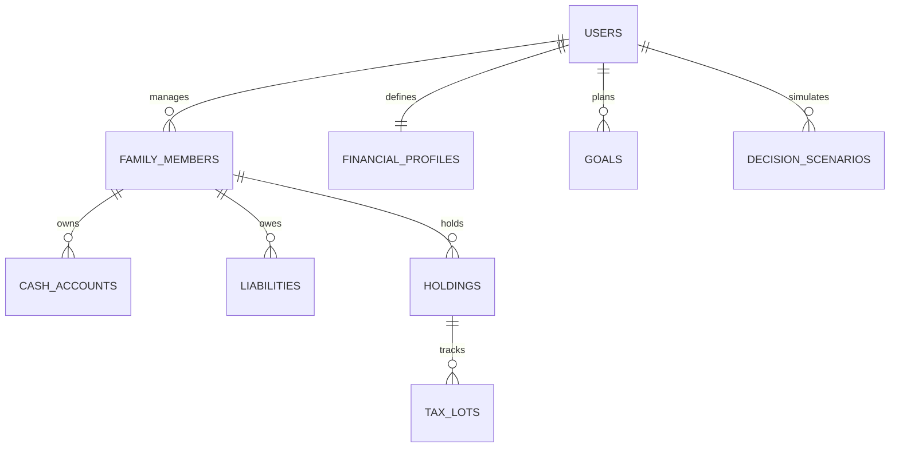

# Finlight V1: Family Wealth Decision Platform — Architecture & Product Specification

## 1. Executive Summary & Product Thesis

**Finlight** is a local-first, privacy-focused Family Wealth Decision Platform.

Traditional financial apps operate on a passive paradigm:
$$\text{Data} \longrightarrow \text{Dashboard} \longrightarrow \text{Charts}$$

Finlight differentiates through an active decision paradigm:
$$\text{Consolidate} \longrightarrow \text{Understand} \longrightarrow \text{Simulate} \longrightarrow \text{Decide}$$

Finlight enables a **Family CFO** (the household financial operator) to understand the family's complete financial position and simulate the consequences of real financial moves before taking action.

### The Signature Differentiator
When a user asks: *"I need ₹5,00,000 in the next 30 days,"* Finlight does not merely show holdings. It generates comparable, neutral scenarios evaluating:
- Direct withdrawal friction (estimated taxes, exit loads, pre-closure penalties)
- Emergency runway impact (months of essential obligations remaining)
- Post-action asset allocation drift
- Goal disruption index (delays to high-priority goals)

---

## 2. Core Financial Model & Mathematical Identities

### 2.1 Balance Sheet & Wealth Definitions
$$\text{Gross Wealth} = \text{Liquid Wealth} + \text{Invested Wealth} + \text{Fixed Wealth}$$
$$\text{Net Worth} = \text{Gross Wealth} - \text{Total Liabilities}$$

- **Liquid Wealth**: Bank savings, auto-sweep accounts, liquid mutual funds ($T+0$ to $T+1$, 0% exit friction).
- **Invested Wealth**: Market value of Mutual Funds (Equity/Debt/Hybrid), Listed Stocks, ETFs, Gold.
- **Fixed Wealth**: Fixed Deposits (accrued interest, contractual maturity, pre-closure penalty).
- **Total Liabilities**: Outstanding balances across home, auto, personal loans, and credit lines.

### 2.2 Cash Flow & Emergency Runway
$$\text{Monthly Obligations} = \text{Essential Expenses} + \text{Debt Servicing (EMIs)}$$
$$\text{Emergency Reserve Target} = \text{Monthly Obligations} \times \text{Configured Months}$$
$$\text{Emergency Reserve Gap} = \text{Liquid Cash} - \text{Emergency Reserve Target}$$
$$\text{Emergency Runway (Months)} = \frac{\text{Liquid Cash}}{\text{Monthly Obligations}}$$
$$\text{Decision-Available Cash} = \text{Liquid Cash} - \text{Protected Emergency Reserve} - \text{Known Near-Term Obligations}$$

### 2.3 Tripartite Risk Model
Finlight separates risk into three non-collapsible dimensions:
1. **Risk Capacity**: What financial loss can the household realistically absorb? Computed deterministically from monthly surplus, emergency runway, dependency ratio, and debt burden.
2. **Risk Tolerance**: How psychologically comfortable is the investor with market drawdowns?
3. **Risk Requirement**: What rate of return is mathematically required to achieve active family goals?

---

## 3. Database Schema (Drizzle ORM)



### Table Specifications
1. **`family_members`**:
   - `id`, `name`, `relation` (Self, Spouse, Father, Mother, Child, Other), `age`, `employment_status`, `monthly_income`, `income_type` (Stable/Variable), `risk_tolerance`, `investment_experience`.
2. **`financial_profiles`** (Household level):
   - `monthly_essential_expenses`, `monthly_discretionary_expenses`, `base_emergency_months` (default: 6), `emergency_adjustment_factors`.
3. **`cash_accounts`**:
   - `id`, `owner_member_id`, `institution`, `account_name`, `account_type` (Savings, Auto-Sweep, Liquid), `current_balance`.
4. **`liabilities`**:
   - `id`, `owner_member_id`, `name`, `type` (Home, Auto, Personal, Credit), `outstanding_balance`, `interest_rate_pct`, `monthly_emi`.
5. **`holdings`**:
   - `id`, `owner_member_id`, `asset_type` (`MF`, `Stock`, `ETF`, `FD`, `Gold`), `name`, `identifier` (AMFI Code/Symbol), `total_units`, `current_nav`, `current_value`, `maturity_date`, `interest_rate_pct`, `exit_load_window_days`, `exit_load_pct`.
6. **`tax_lots`**:
   - `id`, `holding_id`, `purchase_date`, `units`, `buy_price`, `remaining_units`.
7. **`goals`**:
   - `id`, `name`, `priority` (P1/P2/P3), `target_amount`, `target_year`, `linked_holding_ids`.
8. **`decision_scenarios`**:
   - `id`, `type` (`WITHDRAW` / `INVEST`), `status` (`DRAFT`, `SELECTED`, `EXECUTED`), `request_params`, `scenario_data`, `actual_transaction_receipt`.

---

## 4. Snapshot Pipeline & Engine Architecture

Finlight follows a modular domain architecture (`Option 1`):

```
lib/engine/
├── types.ts                    # Canonical HouseholdFinancialState & Scenario interfaces
├── state-builder.ts            # Pure compiler: DB rows -> HouseholdFinancialState
├── metrics.ts                  # Pure math: Net worth, runway, surplus, allocation drift
│
├── tax/
│   ├── types.ts                # Tax lot matching inputs & outputs
│   ├── lot-matcher.ts          # FIFO redemption simulation
│   └── rules-2024-25.ts        # FY 2024-25 Indian capital gains & slab tax rules
│
└── decision/
    ├── withdrawal-engine.ts    # Generates 4 liquidation scenarios
    └── investment-engine.ts    # Generates Lump Sum & Recurring SIP scenarios
```

### Versioned Tax Rules (`rules-2024-25.ts`)
- **Equity MFs & Stocks/ETFs**:
  - $\le 365\text{ days} \to \text{STCG}$ at 20%.
  - $> 365\text{ days} \to \text{LTCG}$ at 12.5% on cumulative gains exceeding ₹1.25L annual exemption.
- **Debt MFs & Fixed Deposits**:
  - Accrued gains/interest taxed as regular income at owner's marginal slab.
- **Gold**:
  - $> 730\text{ days} \to \text{LTCG}$ at 12.5%; otherwise slab.
- **Output Definition**: Explicitly labeled as **Estimated Tax Impact**.

---

## 5. Decision Workflow 1: Withdraw Money

### 5.1 Lifecycle
$$\text{Request} \to \text{Eligibility Filter} \to \text{FIFO Tax Matching} \to \text{Consequence Engine} \to \text{Scenario Comparison} \to \text{Execution Guide} \to \text{Actual Record}$$

### 5.2 Scenarios Generated (Neutral Presentation)
1. **Scenario A: Use Cash**
   - Source: Bank savings. Zero tax, zero exit load, instant settlement ($T+0$), but reduces emergency runway.
2. **Scenario B: Break Fixed Deposit**
   - Source: Pre-closed FDs. Incurs premature penalty (0.5%–1%) and slab tax; preserves market holdings and cash runway.
3. **Scenario C: Redeem Mutual Fund**
   - Source: MF equity/debt lots via FIFO. Incurs estimated capital gains tax and exit loads; alters portfolio allocation.
4. **Scenario D: Cash + MF**
   - Source: Hybrid split between surplus cash and overweight equity lots.

### 5.3 Two-Tier Consequence Card
- **Tier 1 (How do I get the money?)**: Source asset, gross liquidated, estimated tax, exit load/penalties, net cash received.
- **Tier 2 (What happens afterward?)**: Post-withdrawal emergency runway, post-withdrawal allocation drift, goal disruption, settlement time.
- **Negative Outcome Handling**: If all scenarios breach household constraints (runway floor or P1 goal failure), Finlight displays:
  > *"No evaluated scenario meets the configured household constraints without a material consequence."*
  Allows CFO to adjust withdrawal amount, timing, or constraints.

---

## 6. Decision Workflow 2: Invest Money

### 6.1 Mode 1: Lump Sum Deployment
- **Safety Gate**: Tests emergency reserve gap first. If runway is in deficit, allocates safety buffer before equities.
- **Liability Arbitrage**: Evaluates prepaying debts with $>10\%$ interest rates vs. market risk.
- **Allocation & Goal Solver**: Distributes remaining capital to eliminate negative allocation drift and fund lagging P1 goals.
- **Scenarios**:
  - *Scenario A: Safety & Debt Paydown*
  - *Scenario B: Allocation Realignment*
  - *Scenario C: Goal Acceleration*

### 6.2 Mode 2: Recurring SIP Planning
- **Cash Flow Gate**: Evaluates proposed monthly commitment against `Monthly Surplus`. Warns if SIP consumes $>80\%$ of free cash flow.
- **Scenarios**:
  - *Scenario A: Target Mix Split* (Routes SIP according to target asset ratios 60:30:10).
  - *Scenario B: Goal-Milestone Driven* (Routes monthly run rate to close P1 goal deficits first).

---

## 7. UI Hierarchy & The 5 Screens

```
TOP HEADER: Family: Karmakar Family [▼] | View: Entire Family [▼]
SIDEBAR:
  MAIN
    • Dashboard        (State: "Where does my family stand right now?")
    • Holdings         (Inventory: "What do we own, and who owns it?")
    • Activity & Tax   (History: "What are the tax lot implications?")
    • Analytics        (Interpretation: "What does our position mean?")
  DECISIONS (Visually Distinct)
    • Decision Center  (Simulation: "What happens if we make this move?")
```

### Screen Contracts
1. **Dashboard (`/`)**: Financial Position (Gross Wealth, Net Worth, Total Debt) $\to$ Can we safely act? (Emergency Runway, Available Cash) $\to$ What needs attention? $\to$ Action Triggers (`Withdraw Money`, `Invest Money`).
2. **Holdings (`/holdings`)**: Household-oriented table: Asset, Owner, Type, Current Value, Cost Basis, Gain/Loss, Liquidity Class, Tax Status.
3. **Activity & Tax (`/activity`)**: Tax lots, holding periods, unrealized gains, and estimated tax classification.
4. **Analytics (`/analytics`)**: Asset allocation drift, Tripartite Risk cards with rationale (*"Why?"*), and Goal trajectories.
5. **Decision Center (`/decision`)**: Interactive simulator for **Withdraw Money** and **Invest Money** rendering side-by-side neutral Consequence Cards.

---

## 8. Decision Log

| ID | Topic | Decision | Alternatives Considered | Rationale |
|---|---|---|---|---|
| **D1** | Core Product | Family Wealth Decision Platform | Traditional Portfolio Tracker | Differentiates from MProfit/INDmoney/Arthavi by answering *"What happens if I act?"* |
| **D2** | User Concept | Family CFO (Operator) vs Legal Ownership | Single Owner / Multi-tenant Auth | Matches Indian household reality: one person manages finances across members. |
| **D3** | Asset Scope | 4 Core Assets: MF, Stocks/ETFs, FD, Gold | All-in (Crypto, LIC, NPS, PPF, Bonds) | Prevents premature bloat; master core decision workflow first. |
| **D4** | Cash Accounts | First-Class Entity (`cash_accounts`) | Generic holding | Critical for emergency runway and decision-available cash calculation. |
| **D5** | Decision Center | 2 Tools: Withdraw Money & Invest Money | Include Rebalance / Tax-Harvesting | Rebalance is complex and deferred to V2 to preserve MVP focus. |
| **D6** | Privacy Model | Local-First / Private (Local PostgreSQL) | Hosted Multi-tenant SaaS | Household financial data stays private; Gemini receives only anonymized metrics. |
| **D7** | Tax Calculation | Versioned Rule Set (`Estimated Tax Impact`) | Hardcoded Global Tax Formula | Indian tax rules are FY/instrument-specific; avoids claiming legal tax liability. |
| **D8** | Architecture | Modular Domain Engines + Snapshot Pipeline | Event Sourcing / Monolithic Actions | Clean testability in pure TypeScript without premature event-sourcing complexity. |
| **D9** | Lifecycle | Planned Scenario $\to$ Actual Confirmation | Automatic DB Mutation on Select | Prevents recording planned numbers if actual execution differs. |

---

## 9. Assumptions & Risk Mitigation

1. **SEBI Regulatory Boundary**: Finlight provides decision-support consequence modeling (*"Option A costs ₹X in tax and leaves Y runway; Option B costs ₹Z"*), never prescriptive mandates (*"Buy this stock"* or *"Sell this fund"*).
2. **AI Boundary**: Gemini is an explanation adapter only. It is fed structured consequence cards and translates them into plain English summaries. It never invents financial figures.
3. **Local Deployment**: Runs locally via Bun and PostgreSQL; resilient against network drops. External access is strictly limited to public AMFI NAV updates.
